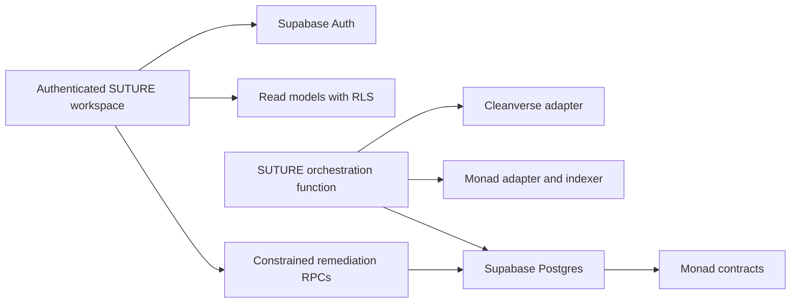

# SUTURE architecture v0.1

## System shape

The browser is an authenticated workspace. It reads tenant-scoped models and invokes constrained workflow RPCs. It does not write compliance state directly, hold provider secrets, call provider APIs, or decide approval authority.

`supabase/functions/suture-orchestrator` is the server-side adapter boundary. It authenticates the caller and verifies membership. Its Cleanverse V5.6 adapter reads `/query_apass` for fresh A-Pass status, then reads `/verify_apass` for a configured A-Token scope or `/validator/verify` for a configured validator-pool scope. Every provider decision is persisted server-side with an opaque request reference, response digest, and restricted raw payload. Missing server secrets, provider scope, or persistence blocks risk actions. The browser has no provider secret or raw provider decision access.

`cleanverse_asset_scopes`, `cleanverse_decisions`, and `cleanverse_webhook_deliveries` have RLS enabled with no authenticated-browser policies. The service role writes them after user membership verification. The webhook receives only documented `ATOKEN_APPLY_RESULT` events, verifies the HMAC over raw body text with the Base64-decoded API key, and deduplicates delivery UUID, provider request ID, and raw-payload digest. The provider documents no credential revocation or policy-change webhook. Credential freshness therefore uses server polling.

The `analyze_lineage` operation reads the active credential observation, policy context, positions, and append-only lineage events under RLS. It calculates source-to-derived paths, affected protocols, represented exposure, unsafe actions, and restricted-exit or migration requirements. It rejects a reachable cross-tenant edge, deduplicates retried event identifiers, preserves the weakest evidence state, and aggregates server-side USD values with integer cents.

The local fixture mode is a labeled non-production presentation path for the hackathon demo. It has no authenticated backend and never represents verified compliance or execution.

## Domain model

| Domain entity | Current record |
| --- | --- |
| Organization | `organizations` |
| User | `auth.users` and `organization_memberships` |
| Wallet | `wallets` |
| Credential | append-only `credentials` observations |
| Asset | `assets` |
| Policy and policy version | `policy_manifests`, append-only `policy_versions` |
| Protocol | `protocols` |
| Position | `positions` |
| Lineage edge | append-only `lineage_edges` |
| Incident | `incidents` |
| Impact snapshot | append-only `impact_snapshots` and `incident_impacts` |
| Remediation plan and action | `remediation_plans`, append-only `remediation_actions` |
| Approval | append-only `approval_records` |
| Evidence | `evidence_items` and per-record evidence state |
| Audit receipt | append-only `audit_receipts` and `audit_events` |

Every record that carries a compliance assertion has an evidence state: `none`, `asserted`, `verified`, or `contested`. A model or fixture result must never use `verified` unless an independent provider or chain observation supports it.

## Authority and tenant boundary

- Supabase Auth identifies the user. A connected wallet is not authentication.
- RLS restricts every tenant record to active organization membership.
- Cross-tenant reference triggers verify that every linked wallet, asset, protocol, position, policy, incident, snapshot, plan, and action belongs to the same organization.
- Authenticated browser clients only receive table `SELECT` permissions. Security-definer functions own onboarding and remediation lifecycle writes.
- Immutable policy versions, credential observations, lineage edges, snapshots, approvals, remediation actions, receipts, and audit events reject updates and deletes.
- Remediation approval and execution require an owner or issuer administrator. The execution function locks the plan row, returns the existing receipt on replay, and records a simulated action only for the labeled demo scenario.
- Live execution runs through `suture-executor`, which records the transaction hash before broadcast, waits for a receipt, and issues an audit receipt bound to the chain result. An unobserved outcome is persisted as `uncertain` with the hash retained, and reconciliation settles it from chain state. Outcomes are written as superseding append-only rows; the submission row is never rewritten. The executor RPCs are service-role only.

## Contracts

The contracts are deployed to Monad testnet (chain `10143`) and all eight are
`exact_match` source-verified on Sourcify. Addresses and transaction hashes are
in `docs/MONAD.md`. The asset and eligibility oracle are mocks, so the slice
demonstrates the policy and lineage mechanism rather than a regulated
instrument, and the contracts are not independently audited.

- `PolicyManifestRegistry` stores immutable historical policy versions, active references, issuer control, policy-authority control, and emergency mode. Future versions are rejected until an authorized scheduler exists, so an inactive future version never replaces an enforceable one.
- `PositionLineageRegistry` permits registered protocol recorders to append source and derived position edges with owner, transaction, policy, timestamp, and asserted evidence. Contracts cannot self-label provenance as verified.
- `BoundVault` checks active policy and eligibility before a source asset deposit. It verifies the exact ERC-20 balance delta, creates receipt positions, restricts exits, and funds an approved remediation only after the holder calls the vault and the replacement wallet passes eligibility.
- `MockCreditMarket` locks a vault receipt after eligibility and policy checks, emits collateral and debt lineage, and releases collateral only after repayment.
- `RemediationEscrow` accepts assets only from an allowlisted vault after policy-authority opening and approval. It verifies the expected asset balance increase before funding and releases only funded user-authorized recovery assets to the replacement wallet.

Policy activation, a deposit that recorded on-chain lineage, and a complete
remediation cycle — open, approve with a separate key, fund from the source
wallet, release — have all been executed on testnet and verified from their
receipts. Live Cleanverse requests and credential evaluation are recorded in
`docs/CLEANVERSE_VERIFICATION.md`.

No indexer observation exists: chain reads are point-in-time JSON-RPC, with no
synced cursor, reorg handling, or backfill. Cleanverse lists `monad` as a chain
label but supplies no Monad deployment addresses, RPC endpoint, or chain ID, so
the deployment map is SUTURE's own. See `docs/MONAD_CLEANVERSE.md`.

## Operational paths

1. An authorized server ingestion path records an append-only credential or policy observation with evidence metadata.
2. The lineage service records a policy-versioned edge with protocol, owner wallet, transaction, evidence, timestamp, and idempotency key for each transformation.
3. The orchestration function calculates the impact graph. A constrained RPC persists an immutable impact snapshot for an incident.
4. A compliance operator creates a plan through a constrained server operation.
5. An owner or issuer administrator records approval or rejection.
6. A deterministic idempotency key controls a remediation action. The current demo flow emits a clearly simulated receipt. A live flow must submit to a verified adapter, reconcile the result, then issue a receipt.
